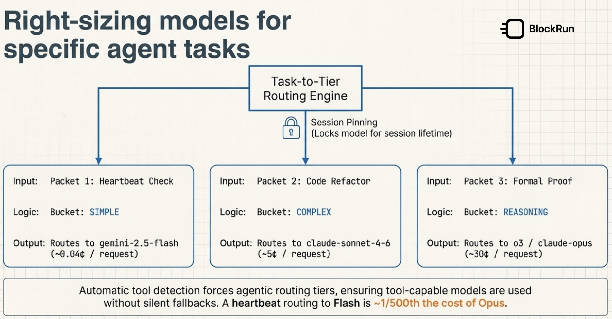

# The Most AI-Agent-Native Router for OpenClaw

> *OpenClaw is one of the best AI agent frameworks available. Its LLM abstraction layer is not.*

---

## The $248/Day Problem


From [openclaw/openclaw#3181](https://github.com/openclaw/openclaw/issues/3181):

> *"We ended up at $248/day before we caught it. Heartbeat on Opus 4.6 with a large context. The dedup fix reduced trigger rate, but there's nothing bounding the run itself."*

> *"11.3M input tokens in 1 hour on claude-opus-4-6 (128K context), ~$20/hour."*

Both users ended up disabling heartbeat entirely. The workaround: `heartbeat.every: "0"` — turning off the feature to avoid burning money.

The root cause isn't configuration error. It's that OpenClaw's LLM layer has no concept of what things cost, and no way to stop a run that's spending too much.

---

## What OpenClaw Gets Wrong at the Inference Layer


OpenClaw is an excellent orchestration framework — session management, tool dispatch, agent routing, memory. But every request it makes hits a single configured model with no awareness of:

**Cost tier** — A heartbeat status check doesn't need Opus. A file read result doesn't need 128K context. OpenClaw sends both to the same model at the same price.

**Rate limit isolation** — When one provider hits a 429, OpenClaw's failover logic applies that cooldown to the entire profile, not just the offending model. Every model in the same group is penalized ([#49834](https://github.com/openclaw/openclaw/issues/49834)). If you configured 5 models for fallback, one slow provider can block all of them.

**Empty/degraded responses** — Some providers return HTTP 200 with empty content, repeated tokens, or a single newline. OpenClaw passes this through to the agent. The agent either errors out, loops, or silently gets a blank response ([#49902](https://github.com/openclaw/openclaw/issues/49902)).

**Error semantics** — OpenClaw's failover logic has known gaps. We found and fixed two while building ClawRouter:

- **MiniMax HTTP 520** ([PR #49550](https://github.com/openclaw/openclaw/pull/49550)) — MiniMax returns `{"type":"api_error","message":"unknown error, 520 (1000)"}` for transient server errors. OpenClaw's classifier required both `"type":"api_error"` AND the string `"internal server error"`. MiniMax fails the second check. Result: no failover, silent failure, retry storm.

- **Z.ai codes 1311 and 1113** ([PR #49552](https://github.com/openclaw/openclaw/pull/49552)) — Z.ai error 1311 means "model not on your plan" (billing — stop retrying). Error 1113 means "wrong endpoint" (auth — rotate key). Both fell through to `null`, got treated as `rate_limit`, triggered exponential backoff, and charged for every retry.

**Context size** — Agents accumulate context. A 10-message conversation with tool results can easily hit 40K+ tokens. OpenClaw sends the full context every request, on every retry.

---

## ClawRouter: Built for Agentic Workloads


ClawRouter is a local OpenAI-compatible proxy, purpose-built for how AI agents actually behave — not how simple chat clients do. It sits between OpenClaw and the upstream model APIs.

```
OpenClaw → ClawRouter → blockrun.ai → GPT-4o / Opus / Gemini / ...
                ↑
         All the smart stuff happens here
```

### 1. Token Compression — 7 Layers, Agent-Aware


Agents are the worst offenders for context bloat. Tool call results are verbose. File reads return thousands of lines. Conversation history compounds with every turn.

ClawRouter compresses every request through 7 layers before it hits the wire:

| Layer | What it does | Saves |
|-------|-------------|-------|
| Deduplication | Removes repeated messages (retries, echoes) | Variable |
| Whitespace | Strips excessive whitespace from all content | 2–8% |
| Dictionary | Replaces common phrases with short codes | 5–15% |
| Path shortening | Codebook for repeated file paths in tool results | 3–10% |
| JSON compaction | Removes whitespace from embedded JSON | 5–12% |
| **Observation compression** | **Summarizes tool results to key information** | **Up to 97%** |
| Dynamic codebook | Learns repetitions in the actual conversation | 3–15% |

Layer 6 is the big one. Tool results — file reads, API responses, shell output — can be 10KB+ each. The actual useful signal is often 200–300 chars. ClawRouter extracts errors, status lines, key JSON fields, and compresses the rest. Same model intelligence, 97% fewer tokens on the bulk.


**Overall reduction: 15–40% on typical agentic workloads.** On the $248/day scenario, that's $150–$200/day in savings from compression alone, before any routing changes.

### 2. Automatic Tier Routing — Right Model for Each Request



ClawRouter classifies every request before forwarding:

```
heartbeat status check     →  SIMPLE   →  gemini-2.5-flash      (~0.04¢ / request)
code review, refactor      →  COMPLEX  →  claude-sonnet-4-6      (~5¢ / request)
formal proof, reasoning    →  REASONING →  o3 / claude-opus      (~30¢ / request)
```

**Tool detection is automatic.** When OpenClaw sends a request with tools attached, ClawRouter forces agentic routing tiers — guaranteeing tool-capable models and preventing the silent fallback to models that refuse tool calls.

**Session pinning.** Once a session selects a model for a task, ClawRouter pins that model for the session lifetime. No mid-task model switching, no consistency issues across a long agent run.

The heartbeat that was burning $248/day on Opus routes to Flash at ~1/500th the cost. Same heartbeat feature, working as designed.

### 3. Per-Model Rate Limit Isolation — No Cross-Contamination

When a provider returns 429, ClawRouter marks that specific model as rate-limited for 60 seconds ([#49834](https://github.com/openclaw/openclaw/issues/49834)). Other models in the fallback chain are unaffected. If Claude Sonnet gets rate-limited, Gemini Flash and GPT-4o continue working. No cascade.

Before failing over, ClawRouter also retries the rate-limited model once after 200ms. Token-bucket limits often recover within milliseconds — most short-burst 429s resolve on the first retry without ever touching a fallback model.

### 4. Empty Response Detection — No Silent Failures

ClawRouter inspects every HTTP 200 response body before forwarding it ([#49902](https://github.com/openclaw/openclaw/issues/49902)). Blank responses, repeated-token loops, and single-character outputs trigger model fallback — the same as a 5xx. The agent never sees a degraded response that would cause it to loop or silently fail.

### 5. Correct Error Classification — No Retry Storms

ClawRouter classifies errors at the HTTP/body layer before OpenClaw sees them:

```
401 / 403              → auth_failure    → stop retrying, rotate key
402 / billing body     → quota_exceeded  → stop retrying, surface alert
429                    → rate_limited    → backoff, try next model
529 / overloaded body  → overloaded      → short cooldown, fallback model
5xx / 520              → server_error    → retry with different model
Z.ai 1311              → billing         → stop retrying
Z.ai 1113              → auth            → rotate key
MiniMax 520 (api_error)→ server_error    → retry with fallback
```

Per-provider error state is tracked independently. If MiniMax is having a bad hour, Anthropic and OpenAI routes continue working. No cross-contamination, no single provider poisoning the session.

### 6. Session Memory — Agents That Remember

OpenClaw sessions can be long-lived. ClawRouter maintains a session journal — extracting decisions, results, and context from each turn — and injects relevant history when the agent asks questions that reference earlier work.

Less context repeated = fewer tokens = lower cost. Agents that need to recall earlier decisions don't need to carry the entire history in every prompt.

### 7. x402 Micropayments — Wallet-Based Budget Control

ClawRouter pays for inference via [x402](https://x402.org/) USDC micropayments (Base or Solana). You load a wallet. Each inference call costs exactly what it costs. When the wallet runs low, requests stop cleanly.

There is no monthly invoice. There is no 3am email. There is a wallet balance, and it either has funds or it doesn't. Wallet-based billing means your budget stops the burn — not a monthly invoice that arrives after the damage is done.

**`maxCostPerRun`** — a per-session cost ceiling that stops or downgrades requests once a session exceeds a configured threshold (e.g., `$0.50`). This closes the remaining gap ([#3181](https://github.com/openclaw/openclaw/issues/3181)) where a wallet with sufficient funds can still accumulate within a single run. Two modes: `graceful` (downgrade to cheaper models) and `strict` (hard 429 once the cap is hit).

```
41+ models. One wallet. Pay per call.
```

---

## OpenClaw + ClawRouter: The Full Picture

| Problem | OpenClaw alone | OpenClaw + ClawRouter |
|---------|---------------|----------------------|
| Heartbeat cost overrun | No per-run cap | Tier routing → 50–500× cheaper model |
| Large context | Full context every call | 7-layer compression, 15–40% reduction |
| Tool result bloat | Raw output forwarded | Observation compression, up to 97% |
| Rate limit contaminates profile | All models penalized (#49834) | Per-model 60s cooldown, others unaffected |
| Empty / degraded 200 response | Passed through to agent (#49902) | Detected, triggers model fallback |
| Short-burst 429 failover | Immediate failover to next model | 200ms retry first, failover only if needed |
| MiniMax 520 failure | Silent drop / retry storm | Classified as server_error, retried correctly |
| Z.ai 1311 (billing) | Treated as rate_limit, retried | Classified as billing, stopped immediately |
| Mid-task model switch | Model can change mid-session | Session pinning, consistent model per task |
| Monthly billing surprise | Possible | Wallet-based, stops when empty |
| Per-session cost ceiling | None | `maxCostPerRun` — graceful or strict cap |
| Cost visibility | None | `/stats` with per-provider error counts |

---

## Getting Started

```bash
npm install -g @blockrun/clawrouter
clawrouter init
```

Point OpenClaw at `http://localhost:3729`. Your existing config, tools, sessions, and extensions are unchanged.

```yaml
# ~/.openclaw/config.yaml
apiBaseUrl: http://localhost:3729/v1
```

Load a wallet, choose a model profile (`eco` / `auto` / `premium` / `agentic`), and run.

---

## On Our OpenClaw Contributions

We contribute upstream when we find bugs. The two PRs linked above fix real error classification gaps. Everyone using OpenClaw directly benefits.

ClawRouter exists because proxy-layer cost control, context compression, and agent-aware routing are fundamentally gateway concerns — not framework concerns. OpenClaw can't know that your heartbeat doesn't need Opus. It can't compress tool results it hasn't seen. It can't enforce a wallet ceiling.

That's what ClawRouter is for.

---

*[github.com/BlockRunAI/ClawRouter](https://github.com/BlockRunAI/ClawRouter) · [blockrun.ai](https://blockrun.ai) · `npm install -g @blockrun/clawrouter`*
